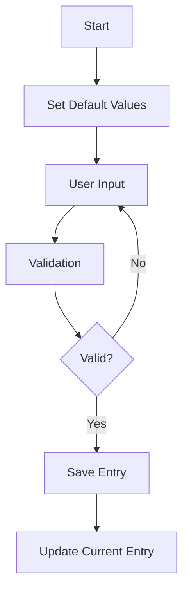
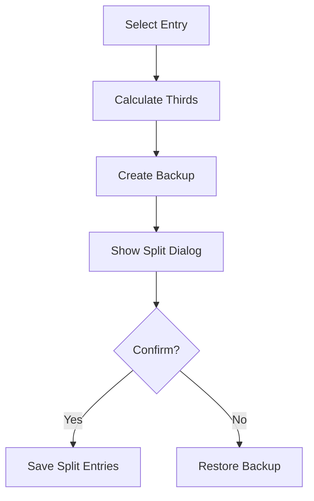
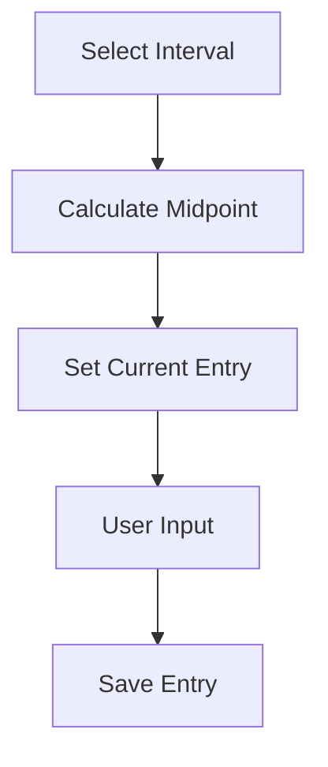

# QuickLogger Application Review

## Project Overview
QuickLogger is a geological drill hole logging application built with React, TypeScript, and Vite. It manages geological data entries with precise interval management.

## Core Components

### 1. Database Layer (`DatabaseService.ts`)

#### Key Functions:
- `initialize()`: Sets up IndexedDB database
- `addEntry(entry)`: Adds new log entry with backup
- `getBackupEntry(id)`: Retrieves backup of an entry
- `getEntriesByHole(drillholeId)`: Gets all entries for a drill hole
- `backupEntry(entry)`: Creates backup before modifications

#### Data Flow:
1. Entries are stored in IndexedDB
2. Backups are created before modifications
3. Each entry has unique ID and drill hole reference

### 2. Quick Log Interface (`QuickLogInterface.tsx`)

#### State Management:
```typescript
interface State {
  currentEntry: Partial<LogEntry>;
  entries: LogEntry[];
  splitState: {
    originalEntry: LogEntry | null;
    topEntry: LogEntry | null;
    middleEntry: LogEntry | null;
    bottomEntry: LogEntry | null;
  };
  isAddingBetween: boolean;
  showSplitDialog: boolean;
}
```

#### Key Functions:

##### Entry Management:
- `handleSave()`: Saves new entry
  - Validates entry
  - Creates backup
  - Updates current entry with next interval

##### Split Operations:
- `handleSplitClick(entry)`: Initiates split
  - Calculates thirds
  - Creates backup
  - Shows split dialog

- `handleSplitConfirm()`: Confirms split
  - Deletes original
  - Adds three new entries
  - Updates current entry

- `handleSplitCancel()`: Cancels split
  - Restores from backup
  - Cleans up split entries
  - Resets state

##### Add Between:
- `handleAddBetween(from, to)`: Adds entry between
  - Calculates midpoint
  - Sets current entry values
  - Enables adding between mode

### 3. Log Entry List (`LogEntryList.tsx`)

#### Features:
- Displays entries in order
- Handles entry deletion
- Provides split and add-between triggers
- Shows validation errors

#### Key Functions:
- `renderEntry()`: Renders single entry
- `handleDelete()`: Deletes entry with confirmation
- `handleSplit()`: Triggers split dialog
- `handleAddBetween()`: Triggers add between mode

### 4. Quick Log Form (`QuickLogForm.tsx`)

#### Features:
- Handles entry input
- Validates fields
- Shows field errors
- Manages auto-save

#### Key Functions:
- `handleSubmit()`: Processes form submission
- `validateFields()`: Validates all fields
- `handleFieldChange()`: Updates field values
- `autoSave()`: Handles auto-save functionality

## Critical Workflows

### 1. Adding New Entry


### 2. Splitting Entry


### 3. Adding Between


## Known Issues

### 1. Default Values
- **Issue**: Default values not showing in split dialog
- **Location**: `QuickLogInterface.tsx`
- **Function**: `handleSplitClick`
- **Fix Required**: Ensure proper state initialization

### 2. Cancel Operation
- **Issue**: Cancel not fully restoring state
- **Location**: `QuickLogInterface.tsx`
- **Function**: `handleSplitCancel`
- **Fix Required**: Proper backup restoration

### 3. Add Between Values
- **Issue**: Previous interval not used for from field
- **Location**: `QuickLogInterface.tsx`
- **Function**: `handleAddBetween`
- **Fix Required**: Proper value inheritance

## Data Flow

### Entry Creation:
1. User inputs data
2. Validation occurs
3. Backup created
4. Entry saved
5. State updated
6. UI refreshed

### Entry Modification:
1. Original entry backed up
2. Modifications made
3. New entry saved
4. Original deleted/archived
5. State updated
6. UI refreshed

### Entry Deletion:
1. Confirmation requested
2. Backup created
3. Entry deleted
4. State updated
5. UI refreshed

## Required Fixes

### 1. Default Values
```typescript
// Current:
setCurrentEntry({
  drillhole_id: holeid,
  from: 0,
  to: 1,
});

// Needed:
setCurrentEntry({
  drillhole_id: holeid,
  from: lastEntry ? lastEntry.to : 0,
  to: lastEntry ? lastEntry.to + 1 : 1,
  fields: {}
});
```

### 2. Split Dialog
```typescript
// Current:
setSplitState({
  originalEntry: entry,
  topEntry,
  middleEntry,
  bottomEntry
});

// Needed:
await dbService.backupEntry(entry);
setSplitState({
  originalEntry: entry,
  topEntry: {...topEntry, fields: {...entry.fields}},
  middleEntry: {...middleEntry, fields: {...entry.fields}},
  bottomEntry: {...bottomEntry, fields: {...entry.fields}}
});
```

### 3. Add Between
```typescript
// Current:
handleAddBetween(from, to) {
  setCurrentEntry({from, to: (from + to) / 2});
}

// Needed:
handleAddBetween(from, to) {
  const midpoint = Number(((from + to) / 2).toFixed(2));
  setCurrentEntry({
    drillhole_id: holeid,
    from: Number(from.toFixed(2)),
    to: midpoint,
    fields: {}
  });
  setIsAddingBetween(true);
}
```

## Next Steps

1. Implement all fixes in FIXES.md
2. Add comprehensive error handling
3. Improve state management
4. Add unit tests
5. Add integration tests
6. Improve performance
7. Add data validation
8. Improve UI/UX
