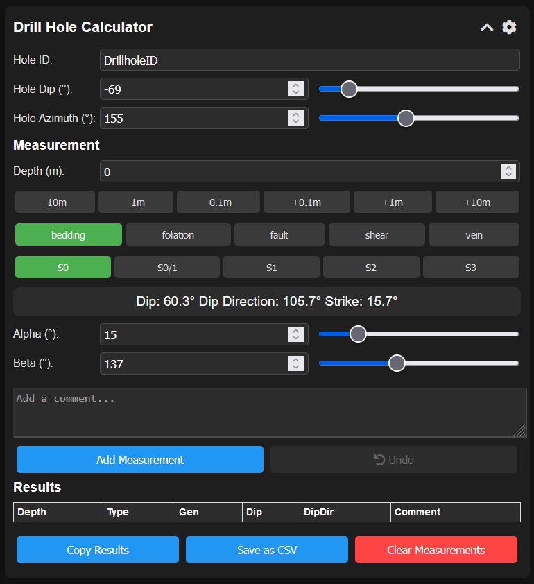

# Drill Hole Calculator

## Overview

The Drill Hole Calculator is a Progressive Web App (PWA) designed for geologists and drilling professionals. This tool provides an easy-to-use interface for inputting measurement data, performing calculations of planes to real world dip and dip direction, and storing results.

## Features

- Calculate dip, dip direction, and strike from alpha and beta measurements
- Support for various measurement types (bedding, foliation, fault, shear, vein)
- Generation types (S0, S0/1, S1, S2, S3)
- Dark mode
- Offline functionality
- Data persistence using local storage
- Export results to CSV
- Copy results to clipboard
- Undo functionality
- Responsive design for use on various devices
- Customizable depth increments

## Usage

1. Enter the Hole ID, Hole Dip, and Hole Azimuth in the respective fields.
2. Use the sliders or input fields to adjust Hole Dip and Hole Azimuth.
3. Set the depth of the measurement using the input field or quick adjustment buttons.
4. Select the measurement type and generation.
5. Input the alpha and beta angles using sliders or input fields.
6. Add a comment if needed.
7. Click "Add Measurement" to save the data.
8. View results in the table below.
9. Use "Copy Results" or "Save as CSV" buttons to export your data.
10. Use the "Undo" button to revert the last added measurement if needed.

## Installation

As a Progressive Web App, the Drill Hole Calculator can be installed on your device for easy access:

1. Visit the app's URL in a modern web browser (Chrome, Firefox, Safari, or Edge).
2. For mobile devices:
   - On Android: You should see a prompt to "Add to Home Screen". Tap this to install the app.
   - On iOS: Tap the share button, then "Add to Home Screen".
3. For desktop:
   - Look for the install icon in the address bar (usually on the right side) and click it.

Alternatively, you can use the app directly in your web browser without installation.

## Contributing

Contributions to the Drill Hole Calculator are welcome! Please feel free to submit pull requests, create issues, or spread the word.

## License

This project is licensed under the MIT License.

## Acknowledgments

- Thanks to Claude, an AI assistant, for providing guidance and assistance during the development process.
- Special acknowledgement to Anssi for their invaluable expertise in developing this calculator.

## Contact

For any queries or suggestions, please open an issue on the GitHub repository or contact the developer via the provided social media links.
